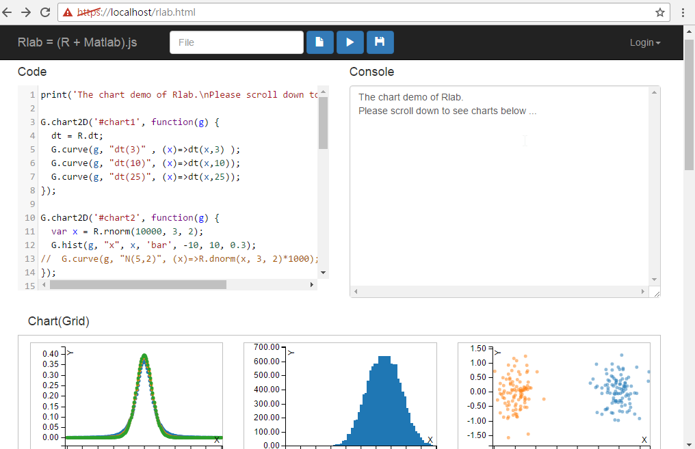

rlab -- A JavaScript Scientific Library like R

## Introduction

The rlab is a A JavaScript Scientific Library like R.

It's based on `lodash.js , jStat.js and numeric.js`

## Install

```
npm install rlab
```

## Use rlab in console mode

file : probabilityEx.js

```javascript
var R = require("rlab");
var dice = R.steps(1,6);
log("sample(1:6, 10)", R.samples(dice, 10));
log("runif(10,0,1)=", R.runif(10, 0, 1).str());
log("rnorm(10,5,1)=", R.rnorm(10, 5, 1).str());
log("dnorm(5,5,1)=", R.dnorm(5, 5, 1));
log("pnorm(5,5,1)=", R.pnorm(5, 5, 1));
log("qnorm(0.5,5,1)=", R.qnorm(0.5, 5, 1));
log("rbinom(10, 5, 0.5)=", R.rbinom(10,5,0.5));
log("dbinom(4, 5, 0.5)=", R.dbinom(4,5,0.5));
log("dbinom(5, 5, 0.5)=", R.dbinom(5,5,0.5));
log("pbinom(4, 5, 0.5)=", R.pbinom(4,5,0.5));
log("qbinom(0.9, 5, 0.5)=", R.qbinom(0.9,5,0.5));

```

run :

```
$ node probabilityEx.js
sample(1:6, 10) [ 3, 5, 3, 2, 3, 3, 1, 2, 4, 3 ]
runif(10,0,1)= [0.9119,0.5899,0.6839,0.1350,0.6894,0.9512,0.8186,0.5826,0.4279,0
.5125]
rnorm(10,5,1)= [5.8961,5.4312,6.0002,5.3623,5.5281,4.4413,6.2144,5.7173,5.3111,1
.3146]
dnorm(5,5,1)= 0.3989422804014327
pnorm(5,5,1)= 0.5
qnorm(0.5,5,1)= 5
rbinom(10, 5, 0.5)= [ 2, 1, 2, 2, 4, 4, 1, 4, 3, 2 ]
dbinom(4, 5, 0.5)= 0.15625
dbinom(5, 5, 0.5)= 0.03125
pbinom(4, 5, 0.5)= 0.96875
qbinom(0.9, 5, 0.5)= 4
```

file : statisticsEx.js

```javascript
var R = require("rlab");
var v = [1,3,5];
log("v.max()=", v.max());
log("v.min()=", v.min());
log("v.sum()=", v.sum());
log("v.normalize()=", v.normalize());
log("v.normalize().sum()=", v.normalize().sum());
log("v.product()=", v.product());
log("v.mean()=", v.mean());
log("v.range()=", v.range());
log("v.median()=", v.median());
log("v.variance()=", v.variance());
log("v.sd()=", v.sd(), " sd^2=", v.sd()*v.sd());
log("v.cov(v)=", v.cov(v), "v.cor(v)=", v.cor(v));
log("factorial(5)=", R.factorial(5));
```

run : 

```
$ node statisticsEx.js
v.max()= 5
v.min()= 1
v.sum()= 9
v.normalize()= [ 0.1111111111111111, 0.3333333333333333, 0.5555555555555556 ]
v.normalize().sum()= 1
v.product()= 15
v.mean()= 1
v.range()= 4
v.median()= 3
v.variance()= 2.6666666666666665
v.sd()= 1.632993161855452  sd^2= 2.6666666666666665
v.cov(v)= 4 v.cor(v)= 1
factorial(5)= 120
```

file : testEx.js

```javascript
var R = require("rlab");
var v = [1,3,5];

var x = R.rnorm(10, 0, 0.1);
log("x=", x.str());
log("x.sort()=", x.sort().str());

var t1=R.ttest({x:x, mu:0});
R.report(t1);
```

run :

```
$ node testEx.js
x= [-0.1405,0.0495,-0.1850,0.0824,0.0687,-0.0854,-0.1049,-0.1171,0.0947,-0.1592]

x.sort()= [-0.0854,-0.1049,-0.1171,-0.1405,-0.1592,-0.1850,0.0495,0.0687,0.0824,
0.0947]
=========== report ==========
name    : ttest(X)
h       : H0:mu=0
alpha   : 0.0500
op      : =
pvalue  : 0.0003
ci      : [-0.2599,-0.1101]
df      : 9.0000
mean    : -0.1850
sd      : 0.1047
```

file : matrixEx.js

```javascript
var M = require("rlab").M;
var v = [1,2,3];
log("v.sin()=", v.sin());
log("v.norm2()=", v.norm2());
log("v.norm2Squared()=", v.norm2Squared());

var A = [[1,2,3],[4,5,6],[7,3,9]];
var AiA = A.inv().dot(A);
log("AiA=\n", AiA.strM());
log("AiA.tr()=\n", AiA.tr().strM());
log("A=\n", A.str());
log("A.mul(0.1)=\n", A.mul(0.1).strM());
log("A.row(1)=", A.row(1));
log("A.col(1)=", A.col(1));
log("A.sumM()=", A.sumM());
log("A.rowSum()=", A.rowSum());
log("A.colSum()=", A.colSum());
log("A.mean(row)=", A.rowMean().str());
log("A.mean(col)=", A.colMean().str());

var D = M.diag(v);
log("D=", D);

var Eλ = M.eigR(A);
var E = Eλ.E, λ=Eλ.lambda;
log("E*[λ]*E-1=", E.dot(λ.diag()).dot(E.inv()).strM());
```

run : 

```
$ node matrixEx.js
v.sin()= [ 0.8414709848078965, 0.9092974268256817, 0.1411200080598672 ]
v.norm2()= 3.7416573867739413
v.norm2Squared()= 14
AiA=
 [[          1,   1.11e-16,  -1.11e-16],
 [          0,          1,  4.441e-16],
 [ -3.331e-16, -3.331e-16,          1]]
AiA.tr()=
 [[          1,          0, -3.331e-16],
 [   1.11e-16,          1, -3.331e-16],
 [  -1.11e-16,  4.441e-16,          1]]
A=
 [[1.0000,2.0000,3.0000],[4.0000,5.0000,6.0000],[7.0000,3.0000,9.0000]]
A.mul(0.1)=
 [[        0.1,        0.2,        0.3],
 [        0.4,        0.5,        0.6],
 [        0.7,        0.3,        0.9]]
A.row(1)= [ 4, 5, 6 ]
A.col(1)= [ 2, 5, 3 ]
A.sumM()= 40
A.rowSum(2)= [ 6, 15, 19 ]
A.colSum(2)= [ 12, 10, 18 ]
A.mean(row)= [2.0000,5.0000,6.3333]
A.mean(col)= [4.0000,3.3333,6.0000]
D= [ [ 1, 0, 0 ], [ 0, 2, 0 ], [ 0, 0, 3 ] ]
E*[λ]*E-1= [[          1,          2,          3],
 [          4,          5,          6],
 [          7,          3,          9]]
```

file : differentialEx.js

```javascript
var R = require("rlab");

var d = R.D.d, i=R.D.i, sin=R.sin, PI = R.PI, x2=(x)=>x*x;

log('d(x^2,2)=', d(x2, 2));
log('d(sin(x/4),pi/4)=', d(sin, PI/4));
log('i(x^2,0,1)=', i(x2,0,1));
log('i(sin(x),0,pi/2)=', i(sin,0,PI/2));

```

run :

```
D:\Dropbox\github\rlab\example>node differentialEx.js
d(x^2,2)= 4.000999999999699
d(sin(x/4),pi/4)= 0.7067531099743674
i(x^2,0,1)= 0.33283350000000095
i(sin(x),0,pi/2)= 0.9997035898637557
```

## build web version

```
$npm run-script build-web

> rlab@0.5.4 build-web D:\Dropbox\github\rlab
> browserify web/_rlab.js -o web/rlab.js
```

## Run rlab on Web

Fdbserver is a used in the server.js of rlab. You have to install fdbserver before start the server.js

```
$ git clone https://github.com/ccckmit/rlab
...
$ cd rlab
...
$ npm install fdbserver
rlab@0.7.1 D:\Dropbox\github\rlab
+-- chai@3.5.0  extraneous
+-- express@4.13.4  extraneous
`-- fdbserver@1.6.6  extraneous

$ node server.js
```

A Screen Shot for Rlab on Web.



## Author

Author: ccckmit

Email : ccckmit@gmail.com 

## License

The rlab project is licensed in MIT license.

Copyright (c) 2013 rlab

Permission is hereby granted, free of charge, to any person obtaining a copy
of this software and associated documentation files (the "Software"), to deal
in the Software without restriction, including without limitation the rights
to use, copy, modify, merge, publish, distribute, sublicense, and/or sell
copies of the Software, and to permit persons to whom the Software is
furnished to do so, subject to the following conditions:

The above copyright notice and this permission notice shall be included in
all copies or substantial portions of the Software.

THE SOFTWARE IS PROVIDED "AS IS", WITHOUT WARRANTY OF ANY KIND, EXPRESS OR
IMPLIED, INCLUDING BUT NOT LIMITED TO THE WARRANTIES OF MERCHANTABILITY,
FITNESS FOR A PARTICULAR PURPOSE AND NONINFRINGEMENT. IN NO EVENT SHALL THE
AUTHORS OR COPYRIGHT HOLDERS BE LIABLE FOR ANY CLAIM, DAMAGES OR OTHER
LIABILITY, WHETHER IN AN ACTION OF CONTRACT, TORT OR OTHERWISE, ARISING FROM,
OUT OF OR IN CONNECTION WITH THE SOFTWARE OR THE USE OR OTHER DEALINGS IN
THE SOFTWARE.


